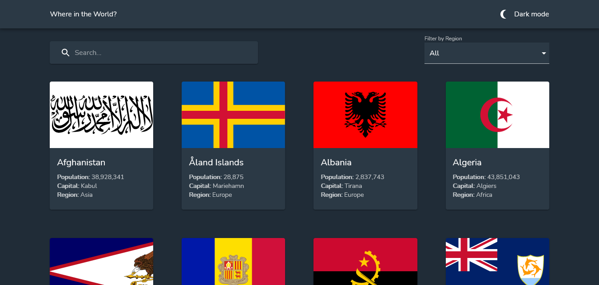
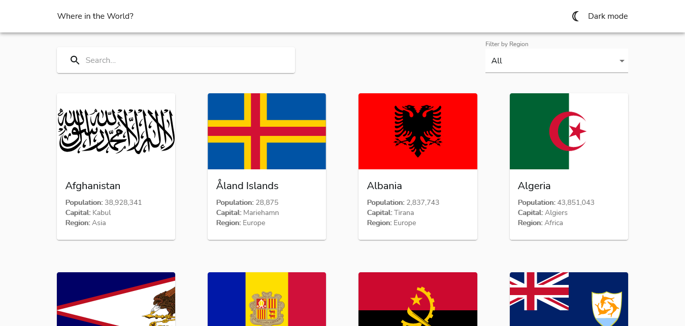
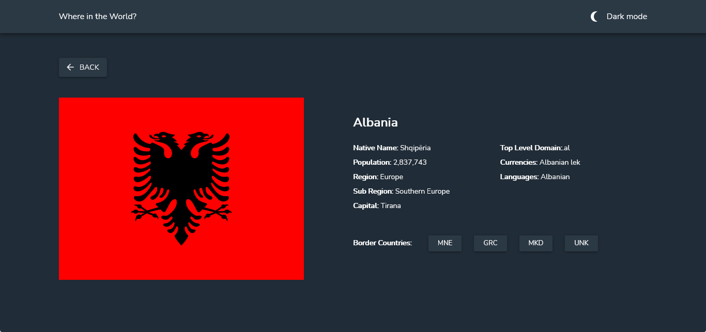
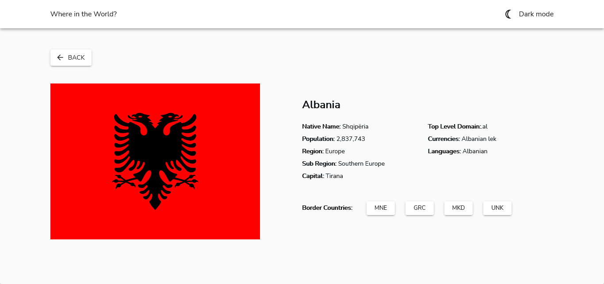
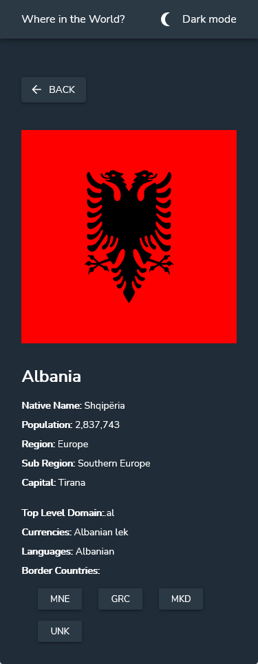
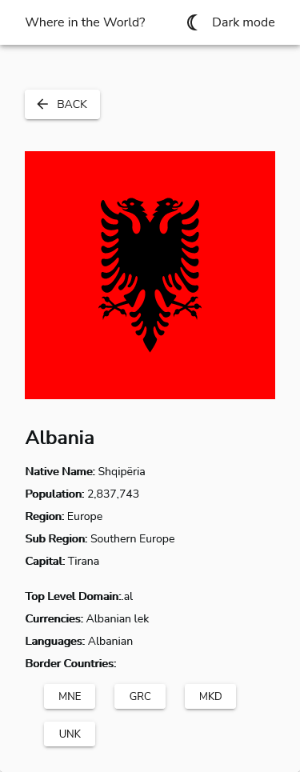
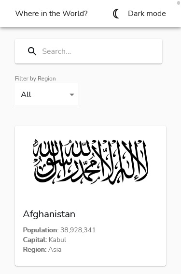
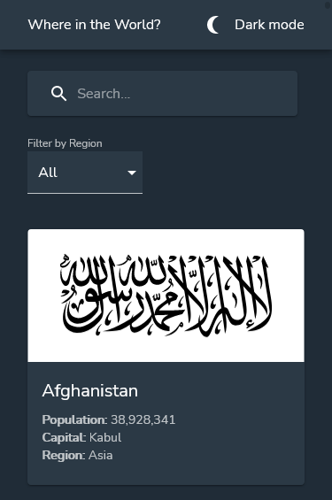

# Frontend Mentor - REST Countries API with color theme switcher solution

This is a solution to the [REST Countries API with color theme switcher challenge on Frontend Mentor](https://www.frontendmentor.io/challenges/rest-countries-api-with-color-theme-switcher-5cacc469fec04111f7b848ca). Frontend Mentor challenges help you improve your coding skills by building realistic projects. This project was bootstrapped with [Create React App](https://github.com/facebook/create-react-app).

## Table of contents

-  [Overview](#overview)
   -  [The challenge](#the-challenge)
   -  [Screenshot](#screenshot)
   -  [Links](#links)
-  [My process](#my-process)
   -  [Built with](#built-with)
   -  [Useful resources](#useful-resources)
-  [Author](#author)

## Overview

### The challenge

Users should be able to:

-  See all countries from the API on the homepage
-  Search for a country using an `input` field
-  Filter countries by region
-  Click on a country to see more detailed information on a separate page
-  Click through to the border countries on the detail page
-  Toggle the color scheme between light and dark mode

### Screenshot

Desktop (width: 1440px) view of home page in dark mode

Desktop (width: 1440px) view of home page in light mode

Desktop (width: 1440px) view of single Country page in dark mode

Desktop (width: 1440px) view of single Country page in light mode

Mobile view (width: 375px) of single Country page in dark mode

Mobile view (width: 375px) of single Country page in light mode

Mobile view (width: 375px) of home page in light mode

Mobile view (width: 375px) of home page in dark mode

### Links

-  Solution URL: [Add solution URL here](https://your-solution-url.com)
-  Live Site URL: [Add live site URL here](https://your-live-site-url.com)

## My process

### Built with

-  Semantic HTML5 markup
-  CSS custom properties
-  Flexbox
-  Mobile-first workflow
-  [React](https://reactjs.org/) - JS library
-  [Material-UI](https://v4.mui.com/) - A React UI Component Library

### Useful resources

-  [Material-UI Documentation](https://v4.mui.com/getting-started/usage/) - This is my first major material UI project, so the documentation helped a lot.
-  [Anthony Sistilli's Material UI playlist on YouTube](https://www.youtube.com/playlist?list=PLQg6GaokU5CwiVmsZ0d_9Zsg_DnIP_xwr) - I learned material UI with this playlist :D.

## Author

-  Twitter - [@femto_ace](https://www.twitter.com/femto_ace)
